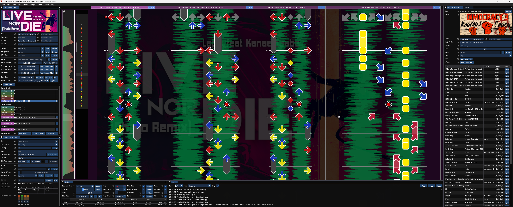

# GrooveAuthor

`GrooveAuthor` is a free open-source editor for authoring [StepMania](https://www.stepmania.com/) charts.

[](StepManiaEditor/docs/screenshot-01.png)

## Highlights

### Robust Chart Generation
`GrooveAuthor` can add more charts to your existing songs almost instantly. It understands modern tech and has incredibly detailed controls for fine-tuning autogen content. All the functionality from [StepManiaChartGenerator](https://github.com/PerryAsleep/StepManiaChartGenerator) is available in-editor.


### Intelligent Pattern Generation
`GrooveAuthor` can generate patterns that integrate seamlessly with your chart. It offers a deep suite of controls so patterns come out just the way you want.


### SSC Gimmicks
`GrooveAuthor` renders `ssc` effects accurately.


### Smooth Zoom
`GrooveAuthor` supports near-infinite zooming with 100% accurate waveform rendering and offset compensation.


### Performant
Other editors stutter or lock up when editing long files but `GrooveAuthor` is built from the ground up to be responsive and fast with all content. `GrooveAuthor` can handle anything from the 2-hour long "90's Dance Megamix" to "24 hours of 100 bpm stream".


## Features

- Open source.
- Support for all major dance game layouts including [StepManiaX](https://stepmaniax.com/) layouts.
- Robust autogen functionality. All the functionality from [StepManiaChartGenerator](https://github.com/PerryAsleep/StepManiaChartGenerator) is available in-editor.
- Accurate `ssc` scroll rate rendering.
- Near infinite zooming with 100% accurate waveform rendering and offset compensation.
- Optional automove. Press one key to add a note and advance for quickly writing streams.
- Modern editing conveniences like copy/paste, undo/redo, intuitive mouse and keyboard controls, mini-map scrollbar, etc.

## Installation

`GrooveAuthor` is in-development and does not yet have any releases.

## Building From Source

Building from source requires Windows 10 or greater and Microsoft Visual Studio Community 2022.

1. Clone the repository and init submodules.
	```
	git clone https://github.com/PerryAsleep/GrooveAuthor.git
	cd ./GrooveAuthor
	git submodule update --init --recursive
	```
2. Open `GrooveAuthor.sln` and build through Visual Studio.

## License

- `GrooveAuthor` is distributed under the [MIT License](LICENSE).
- [MonoGame](https://github.com/PerryAsleep/MonoGame) is distributed under the [Microsoft Public License (Ms-PL) and the The MIT License (MIT)](https://github.com/PerryAsleep/MonoGame/blob/fumen/LICENSE.txt).
- [fmod](./StepManiaEditor/fmod) is distributed in accordance with the [FMOD EULA](https://www.fmod.com/legal).
