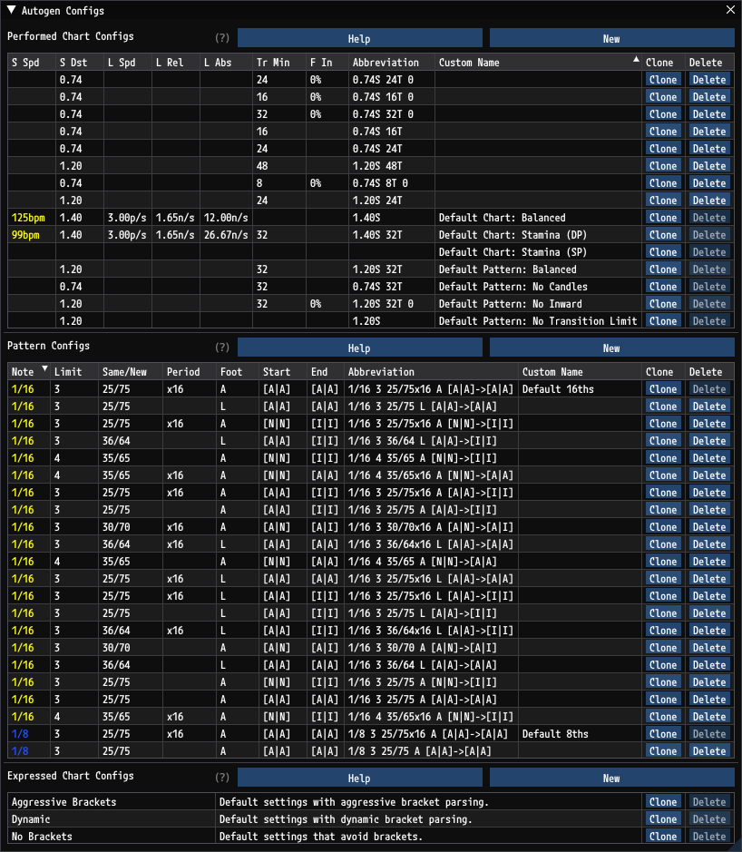

# Autogen Configs

`GrooveAuthor` supports two kinds of automatic step generation:
1. [Pattern Generation](PatternGeneration.md): Automatically generated sequences of steps in a chart.
2. [Chart Generation](ChartGeneration.md): Entire charts automatically generated from other charts.

Autogen Configs allow you to precisely control these behaviors.

## Autogen Configs Window

Autogen Configs can be accessed from the menu bar through `Autogen` > `Configuration...`. This will open the `Autogen Configs` window.

From this window you can browse configs to edit, as well as create or delete configs. There are three types of configs.
- [Performed Chart Configs](PerformedChartConfigs.md)
- [Pattern Configs](PatternConfigs.md)
- [Expressed Chart Configs](ExpressedChartConfigs.md)

## Performed Chart Configs

[Performed Chart Configs](PerformedChartConfigs.md) define settings for how to perform steps when the timing and kinds of steps are known.

### Use in [Chart Generation](ChartGeneration.md)

When generating a chart from an existing chart, the kinds of steps are already known from the existing chart. It is already known exactly when each step should occur, and what kinds of steps should be performed. But when taking those steps and making a new chart from them, you may want to control how those steps are performed. Especially when going from more restrictive formats like `dance-single` to less restrictive formats like `dance-double` it's often important to control things like how often transitions should occur, which lanes should be stepped on more or less than others, how big should individual steps be, is it okay to transition on burst, is stretch okay, etc. Performed Chart Configs let you control these things.

### Use in [Pattern Generation](PatternGeneration.md)

Similarly when generating patterns within an existing chart the steps and their timings are known, and the same rules can be applied to control how those new steps are laid out.

### Performed Chart Config Table

The Performed Chart Config table shows all the Performed Chart Configs. Clicking any row will open the [Performed Chart Config](PerformedChartConfigs.md) window.

Hovering over any header shows a brief description of the column.

Columns can be reordered and resized. Right clicking the header row allows you to hide or add columns.

The sort applied in the Performed Chart Config table applies to all other lists of Performed Chart Configs throughout `GrooveAuthor`.

### Abbreviation

Performed Chart Configs have an automatically generated `Abbreviation`. The abbreviation is shown in some contexts if no Custom Name is set. If however a Custom Name is present, it will always be preferred. The abbreviation is based on common settings for patterns, as patterns are the most common context benefiting from brief names.

An abbreviations looks like this:

`0.74S 32T 0`
- `0.74S`: This shows the minimum distance to apply step tightening rules, if enabled.
- `32T`: This shows the minimum number of steps between transitions, if enabled.
- `0`: This shows the maximum percentage of inward facing steps, if less than 100%.

### Default Chart Configs

`GrooveAuthor` provides a few Performed Chart Configs beginning with "Default Chart". These are meant to be good default options for full chart generation, and starting points for if you want to add your own custom configs.

### Default Pattern Configs

`GrooveAuthor` provides a few Performed Chart Configs beginning with "Default Pattern". These are meant to be good default options for pattern generation, and starting points for if you want to add your own custom configs.

## Pattern Configs

[Pattern Configs](PatternConfigs.md) define settings for what kinds of steps to generate when performing [Pattern Generation](PatternGeneration.md).

### Pattern Config Table

The Pattern Config table shows all the Pattern Configs. Clicking any row will open the [Pattern Config](PatternConfigs.md) window.

Hovering over any header shows a brief description of the column.

Columns can be reordered and resized. Right clicking the header row allows you to hide or add columns.

The sort applied in the Pattern Config table applies to all other lists of Pattern Configs throughout `GrooveAuthor`.

### Abbreviation

Pattern Configs have an automatically generated `Abbreviation`. The abbreviation is shown in some contexts if no Custom Name is set. If however a Custom Name is present, it will always be preferred. The abbreviation summarizes all data from a Pattern Config.

An abbreviations looks like this:

`1/16 3 25/75 A [A|A]->[I|I]`
- `1/16`: This shows the note type of the pattern.
- `3`: This shows the step repetition limit.
- `25/75`: This shows the ratio of same arrow steps to new arrow steps.
- `A` This shows the starting foot.
  - `A` is automatic.
  - `?` is random.
  - `L` is left foot.
  - `R` is right foot.
- `[A|A]` is the starting footing. The first letter is the left foot and the second is the right foot.
  - `A` is same or new lane.
  - `S` is same lane.
  - `N` is new lane.
  - A number is an explicit lane.
- `[I|I]` is the ending footing. The first letter is the left foot and the second is the right foot.
  - `A` is same or new lane to following.
  - `S` is same lane as following.
  - `N` is new lane to following.
  - `I` is ignore following footing.
  - A number is an explicit lane.

### Default Pattern Configs

`GrooveAuthor` provides a few Pattern Configs beginning with "Default". These are meant to be good default options and starting points for if you want to add your own custom configs.

## Expressed Chart Configs

[Expressed Chart Configs](ExpressedChartConfigs.md) define settings for how to interpret existing steps.

### Use in [Chart Generation](ChartGeneration.md)

When autogenerating a new chart from an existing chart, the existing chart needs to be parsed. The settings in an Expressed Chart Config determine how `GrooveAuthor` parses the chart. These settings mostly apply how steps which could be interpreted as jumps or brackets should be treated. For example, certain sections of DDR charts could be naturally bracketed, but DDR never intends for you bracket them.

### Use in [Pattern Generation](PatternGeneration.md)

When generating patterns within an existing chart, parsing the surrounding steps is needed for understanding how the body is supposed to be oriented and which foot should start the pattern to maintain alternating steps.

### Expressed Chart Config Table

The Expressed Chart Config table shows all the Expressed Chart Configs. This table is simpler than the other Autogen Config tables as there aren't as many rules, and it is less likely to need to create many custom Expressed Chart Configs. Clicking any row in this table will open the [Expressed Chart Config](ExpressedChartConfigs.md) window.

## Autogen Config Persistence

All custom Autogen Config data is persisted to the `AutogenConfigs` folder. Changes to custom Autogen Config data are committed when `GrooveAuthor` closes.
- Performed Chart Configs begin with `pcc-`
- Pattern Configs begin with `pc-`
- Expressed Chart Configs begin with `ecc-`

