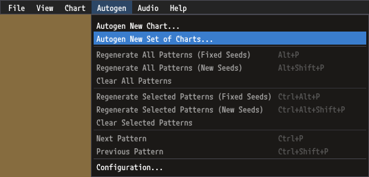

# Chart Generation

Chart Generation is the process of generating new charts from existing charts. This can be used for example to add `dance-double` charts for all the `dance-single` charts in your song, or to add charts for another game type, like SMX or PIU.

## Prerequisites

Chart generation requires the [StepGraph Files](https://github.com/PerryAsleep/StepManiaLibrary/tree/main/StepManiaLibrary/docs/StepGraphs.md#stepgraph-files) for the [ChartTypes](https://github.com/PerryAsleep/StepManiaLibrary/tree/main/StepManiaLibrary/docs/ChartType.md) involved to be loaded. GrooveAuthor loads StepGraph Files based on the `Startup Step Graphs` defined in the `Options`.

## Generating Single Chart

To start generating a chart select `Autogen` > `Autogen New Chart...` from the menu bar.

You can also select `Autogen New Chart...` from the `Chart List` window.

You can also right click a chart in the `Chart List` window and select the `Autogen New Chart From...` item.

All of these options will present the `Autogen Chart` window.

`Source Chart` is the chart to use as input for generating the new chart.

`Expression` specifies which [Expressed Chart Config](ExpressedChartConfigs.md) to use for parsing the `Source Chart`.

`New Chart Type` specifies the [ChartType](https://github.com/PerryAsleep/StepManiaLibrary/tree/main/StepManiaLibrary/docs/ChartType.md) to generate.

`Config` specifies which [Performed Chart Config](PerformedChartConfigs.md) to use for positioning steps in the new chart.

Click the Autogen button to generate a new chart.

Your new chart will show up in the `Chart List` and `GrooveAuthor` will switch focus to the new chart.

## Generating Multiple Charts

To start generating multiple charts select `Autogen` > `Autogen New Set of Charts...` from the menu bar.

This will open the `Autogen Charts` window.

`Source Type` specifies which [ChartType](https://github.com/PerryAsleep/StepManiaLibrary/tree/main/StepManiaLibrary/docs/ChartType.md) to use as input. For example if your song has four `dance-single` charts and `Dance Single` is used as the `Source Type`, four new charts will be generated.

`New Type` specifies the [ChartType](https://github.com/PerryAsleep/StepManiaLibrary/tree/main/StepManiaLibrary/docs/ChartType.md) of the charts to generate.

`Config` specifies which [Performed Chart Config](PerformedChartConfigs.md) to use for positioning steps in the new charts. When generating multiple charts each source chart's [Expressed Chart Config](ExpressedChartConfigs.md) is used. See [Configuring Expressed Chart Configs Per Chart](ExpressedChartConfigs.md#configuring-expressed-chart-configs-per-chart).

Click the Autogen button to generate new charts.

Your new charts will show up in the `Chart List` and `GrooveAuthor` will switch focus to a new chart.

## Bulk Generation

`GrooveAuthor` operates on one song at a time, however all the chart generation functionality it offers is available in [StepManiaChartGenerator](https://github.com/PerryAsleep/StepManiaChartGenerator), which can autogenerate charts for an arbitrary number of songs with one click. `StepManiaChartGenerator` allows you to apply rules globally, or target rules to individual songs or packs with pattern matching. With some simple configuration it is easy to add missing charts for every song on your setup. It is highly recommended to use `StepManiaChartGenerator` instead of `GrooveAuthor` for doing bulk chart generation.