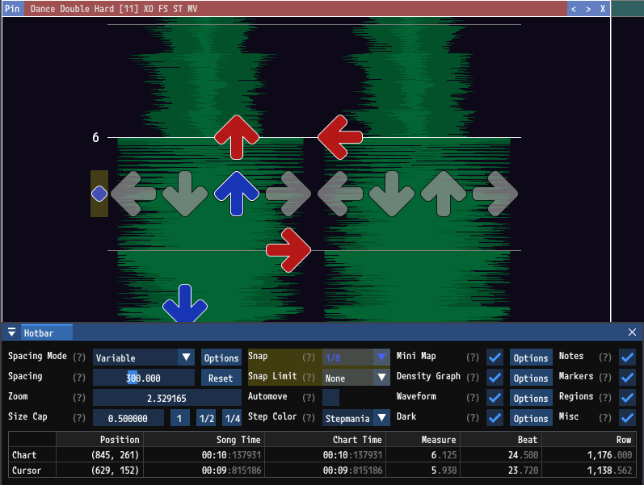

# Chart Navigation

## Navigating Between Charts

### Opening Charts

Charts can be opened from within the `Chart List` window, which can be opened from `View` > `Chart List`.

To open a chart, single-click it. This will add a temporary tab to the scene containing the selected chart. Temporary tabs have a dimmed, left-justified title and a `Pin` button to promote them to dedicated tabs.

Opening another chart will replace the previous chart in the temporary tab.

To keep a chart open double-click the chart within the `Chart List`, or double-click its header in the scene, or press the `Pin` button in the header, or press `Ctrl+Alt+Home`. This will give the chart a dedicated tab. Dedicated tabs have a bright, center-justified title.

`Ctrl+Alt+Left` and `Ctrl+Alt+Right` will open the previous and next charts respectively.

### Focus

At any point in time at most one chart will have focus. The focused chart has a bright border and title. Unfocused charts have dimmer borders and titles.

Many actions and behaviors only apply to the focused chart. For example the focused chart is used for the following:
- The `Chart Properties` window and `Hotbar`.
- The mini map.
- The density graph.
- The waveform. The waveform can be configured to display behind all charts, but its spacing and rate are determined from the focused chart.
- Actions like adding and removing notes apply to the focused chart.

### Changing The Focused Chart

Clicking on any chart or the header for its tab will focus that chart. Additionally `Ctrl+PageUp` and `Ctrl+PageDown` will focus on the previous or next opened chart.

### Closing Charts

Open charts have an `X` button in their headers, which can be used to close them. The `X` button in the `Chart List` can also be used to close a chart. Additionally `Ctrl+F4` and `Ctrl+W` will close the focused chart.

### Reordering Charts

Open charts have `<` and `>` buttons in their headers, which can be used to move them left or right respectively relative to other open charts in the scene. Additionally, the focused chart can be moved left and right with `Ctrl+Alt+PageUp` and `Ctrl+Alt+PageDown`.

## Navigating Within A Chart

### Spacing Mode

The Spacing Mode determines how notes are spaced. It can be changed with the `S` key or within the `Hotbar`. There are three spacing modes.

- `Constant Time`: Notes are spaced by their time. Equivalent to a CMOD in Stepmania.
- `Constant Row`: Notes are spaced by their row.
- `Variable`: Notes are spaced by their row and are affected by all rate altering events. Equivalent to an XMOD in Stepmania.

### Position

The current position of the chart is indicated by the receptors. It is also displayed in the `Hotbar`. When adding or removing notes the current position is used.

### Size Cap

Notes have a maximum size they will be drawn with which is defined by the `Size Cap`. Lowering this value can be beneficial for fitting many charts on screen at once. It functions similar to "mini" in Stepmania.

### Spacing and Zooming

The chart can be zoomed in and out while scrolling while holding `Ctrl`. When zooming in and notes reach their maximum size, zooming will still occur. Zooming is effectively unbounded in both directions. This can be changed in the `Scroll Preferences` window by selecting `Limit Zoom to Size`, which will prevent zooming in further when notes reach their maximum size.

Spacing can be changed without changing the zoom level by scrolling while holding `Shift`.

### Snap

The `Snap` setting limits the allowed positions to the specified note type. In the example above the Snap is set to eighth notes. The icon to the left of the receptors indicates the `Snap` level.

The `Left` and `Right` keys can be used to change the `Snap` level.

The `Snap Limit` will limit `Snap` levels that can be cycled through to note types which evenly divide it. For example if you only want to work with quarter, eighth, and sixteenth notes setting the `Snap Limit` to `1/16` will limit the `Snap` levels to those options.

### Changing Position

The chart position can be moved earlier or later by scrolling up or down or by using the `Up` and `Down` keys. When moving, the `Snap` level is used to control by how much the position is advanced.

`PageUp` and `PageDown` move the position by one measure.

`Home` and `End` move to the start and end of the chart.

`Ctrl+L` and `Ctrl+Shift+L` move to the next and previous Label.

`Ctrl+P` and `Ctrl+Shift+P` move to the next and previous [Pattern](PatternGeneration.md).

### Scroll Bars

The mini map and density graph both function as scroll bars that can be manipulated with the mouse.