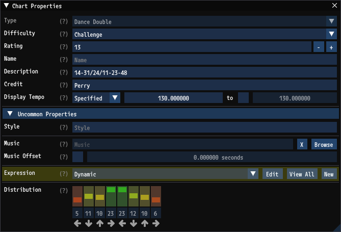
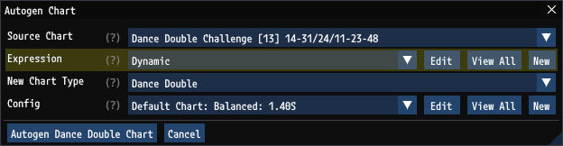
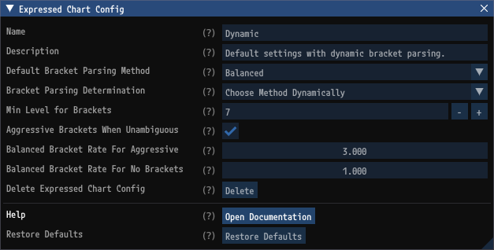
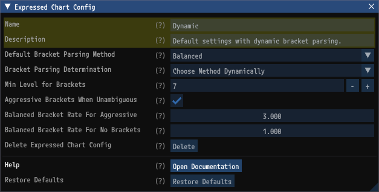
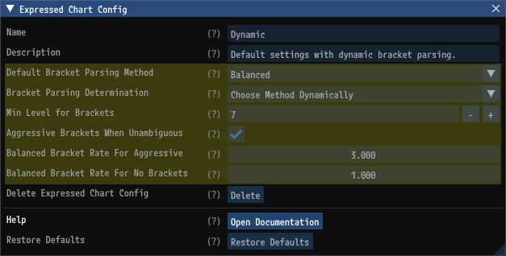

# Expressed Chart Configs

Expressed Chart Configs are a kind of [Autogen Config](AutogenConfigs.md) that define settings for how `GrooveAuthor` parses steps. Parsing steps is the first step towards [Chart Generation](ChartGeneration.md) and it is needed for [Pattern Generation](PatternGeneration.md) to generate patterns that integrate seamlessly with surrounding steps. This document describes Expressed Chart Config settings. For information on how to browse, add, and delete Expressed Chart Configs, see the [Expressed Chart Configs](AutogenConfigs.md#expressed-chart-configs) section of the [Autogen Configs](AutogenConfigs.md) document.

## StepManiaLibrary

`GrooveAuthor` uses [StepManiaLibrary](https://github.com/PerryAsleep/StepManiaLibrary) for autogen functionality. The `StepManiaLibrary` [Expressed Chart](https://github.com/PerryAsleep/StepManiaLibrary/tree/main/StepManiaLibrary/docs/ExpressedChart.md) documentation accurately describes the `GrooveAuthor` functionality, though it is written assuming rules are defined in `json` rather than through the GUI that `GrooveAuthor` provides.

## Configuring Expressed Chart Configs Per Chart

Each chart references an Expressed Chart Config. This can be set in the `Chart Properties` window on the `Expression` property. By default, charts will use the "Dynamic" Expressed Chart Config. The chart's Expressed Chart Config is used when generating patterns within the chart, and when generating new charts using this chart as a base.

## Usage with Autogen

When performing [Chart Generation](ChartGeneration.md) to generate one chart from another, the source chart's Expressed Chart Config will be used by default, as pictured below. When generating multiple charts (e.g. turning all `dance-single` charts into `dance-double` charts), each chart's Expressed Chart Config will be used. When performing [Pattern Generation](PatternGeneration.md) within a chart, that chart's Expressed Chart Config will be used.

## Expressed Chart Config Window

Expressed Chart Configs are edited through the `Expressed Chart Config` window. This is accessible by clicking on an Expressed Chart Config from the [Autogen Configs](AutogenConfigs.md) window.

### Name and Description

`Name` and `Description` are fields which identify and describe Expressed Chart Configs so they can be selected easily throughout `GrooveAuthor`.

### Other Settings

The other settings control how the chart is parsed. Details on these settings can be found in the `StepManiaLibrary` [Expressed Chart](https://github.com/PerryAsleep/StepManiaLibrary/tree/main/StepManiaLibrary/docs/ExpressedChart.md) documentation.

