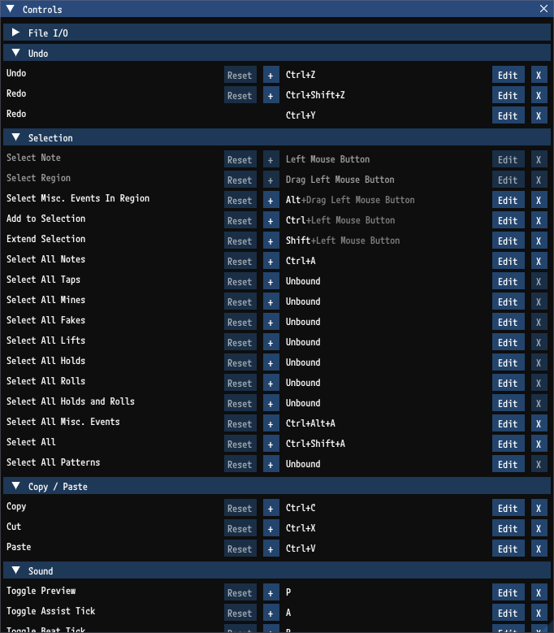

# Key Bindings

Key bindings can be viewed and edited under `Help` > `Controls`.



### Key Binding Behavior

> [!NOTE]
>Prior to v0.3.1 editing key bindings required modifying `Preferences.json`. This is now discouraged in favor of editing through the `Controls` window.

Please be aware of the following if you edit your key bindings:
- A binding will not trigger if another binding containing the same keys is triggering.
- Longer key binding sequences take precedence over shorter key binding sequences.
- Key bindings which are subsets of other key bindings will not trigger if the larger binding is triggering. For example `Toggle Spacing Mode` defaults to `S`. `Save` defaults to `Ctrl+S`. While holding `Ctrl` and then `S`, `Save` will trigger and `Toggle Spacing Mode` will not because `Toggle Spacing Mode` is a subset of `Save`.
- If bindings are known to conflict with other bindings they will appears yellow in the `Controls` window. Select `Edit` to edit the binding and view a list of the conflicts.
- If two actions have conflicting key bindings, the specific actions which will trigger is undefined.
- Some bindings are treated specially and will not block other bindings from triggering. As of this writing these bindings are:
	- `Switch Note to Mine / Roll`
	- `Zoom`
	- `Change Spacing For Current Mode`
	- `Select Misc. Events In Region`
	- `Add to Selection`
	- `Extend Selection`
	- `Lock Receptor Move Axis`

### Key List

All keys supported for bindings can be found below.

<details>
	<summary>Key list</summary>

```json5
Back
Tab
Enter
Escape
Space
PageUp
PageDown
End
Home
Left
Up
Right
Down
Select
Print
Execute
PrintScreen
Insert
Delete
Help
0
1
2
3
4
5
6
7
8
9
A
B
C
D
E
F
G
H
I
J
K
L
M
N
O
P
Q
R
S
T
U
V
W
X
Y
Z
Windows
NumPad0
NumPad1
NumPad2
NumPad3
NumPad4
NumPad5
NumPad6
NumPad7
NumPad8
NumPad9
Multiply
Add
Separator
Subtract
Decimal
Divide
F1
F2
F3
F4
F5
F6
F7
F8
F9
F10
F11
F12
F13
F14
F15
F16
F17
F18
F19
F20
F21
F22
F23
F24
NumLock
Scroll
Shift
Control
Alt
VolumeMute
VolumeDown
VolumeUp
MediaNextTrack
MediaPreviousTrack
MediaStop
MediaPlayPause
SelectMedia
Semicolon
Plus
Comma
Minus
Period
Question
Tilde
OpenBrackets
Pipe
CloseBrackets
Quotes
Backslash
Play
Pause
```
