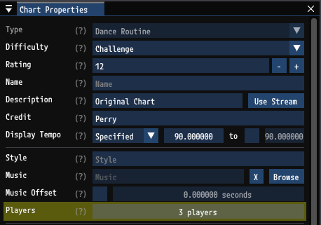
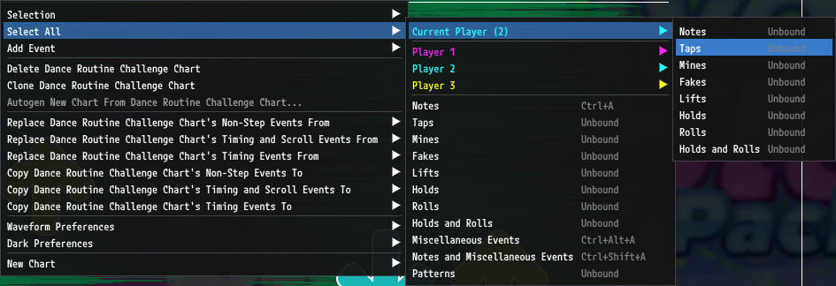

# Multiplayer Charts

`GrooveAuthor` supports `dance-routine`, `pump-routine`, and `smx-team` charts. These formats are for multiple simultaneous players across the full pads. In the DDR/ITG community these charts are typically referred to as "couples" charts. In PIU they are referred to as "co-op" charts. In SMX they are referred to as "team" charts.

## Player Limits

`GrooveAuthor` imposes no limit on the number of players. Limits will be imposed by the program you use to play your charts. In stock Stepmania the limit for a multiplayer chart is two players. In StepF2 it is four.

## Editing Multiplayer Charts

The number of players in a chart can be set in the `Chart Properties` window. This is used for limiting player selection choices throughout the UI.

Each player's notes are a specified color. Colors can be set in the `Multiplayer Preferences` windows. Reducing the `Note Alpha` can let the natural note color blend with the player's color to help maintain rhythm-based or lane-based color.

When editing, one player is active at time. Newly created steps are assigned to the active player. The active player is shown with a marker to the right of the receptors. The color of this marker matches the active player's note color.

The active player can also be viewed and changed in the `Hotbar`. It can also be changed with the `\` key.

A number of useful actions specific to multiplayer charts exist in the right-click context menu. Actions to select steps for the current player can have keybinds assigned to them.

Steps can quickly be assigned to specific players through the context menu. These actions can also have keybinds assigned to them

## StepF2 Support

[StepF2](https://stepf2.blogspot.com/) is a popular Stepmania variant for PIU emulation. It supports up to four player co-op charts. StepF2 uses a custom format for `sm`/`ssc` files which is not compatible with stock Stepmania. You can find details on the differences [here](https://github.com/stepmania/stepmania/wiki/Note-Types#stepf2-notes). `GrooveAuthor` has limited support for loading and saving `sm` and `ssc` files in the StepF2 format. 

### Limitations

- `GrooveAuthor` will not maintain the following attributes for steps in a StepF2 chart:
    - Sudden
    - Hidden
    - Vanish
    - Heart
- `GrooveAuthor` does not support multiplayer pump charts outside of `pump-routine`. StepF2 often uses other formats like `pump-double` to represent co-op charts. When `GrooveAuthor` encounters a `pump-double` chart with multiple players it will change it to a `pump-routine` chart when loading.
- The StepF2 format for multiplayer charts does not support rolls, lifts, or per-player mines. Normally `GrooveAuthor` allows these steps in Pump charts but in the StepF2 format it is impossible to represent them so when saving, their presence will result in an error and failure to save.

### Saving

To save a `pump-routine` chart in a format compatible with StepF2 check `Use StepF2 Format for Pump Routine` under `File` > `Advanced Save Options`. 
