# Pattern Configs

Pattern Configs are a kind of [Autogen Config](AutogenConfigs.md) that define settings for what kinds of steps to generate when performing [Pattern Generation](PatternGeneration.md). This document describes Pattern Config settings and how those settings affect generated steps. For information on how to browse, add, and delete Pattern Configs, see the [Pattern Configs](AutogenConfigs.md#pattern-configs) section of the [Autogen Configs](AutogenConfigs.md) document.

## StepManiaLibrary

`GrooveAuthor` uses [StepManiaLibrary](https://github.com/PerryAsleep/StepManiaLibrary) for autogen functionality. The `StepManiaLibrary` [Pattern](../../StepManiaLibrary/StepManiaLibrary/docs/Pattern.md) documentation accurately describes the `GrooveAuthor` functionality, though it is written assuming rules are defined in `json` rather than through the GUI that `GrooveAuthor` provides.

## Applying Config Rules

When generating steps, many rules are at play and they can almost never all be satisfied perfectly. See [Performed Chart Determination](../../StepManiaLibrary/StepManiaLibrary/docs/PerformedChart.md#performedchart-determination) and [Pattern Determination](../../StepManiaLibrary/StepManiaLibrary/docs/PerformedChart.md#pattern-determination) for specifics on how these rules are combined in order to generate the best pattern.

## Pattern Config Window

Pattern Configs are edited through the `Pattern Config` window. This is accessible by clicking on a Pattern Config from the [Autogen Configs](AutogenConfigs.md) window, or by selecting a pattern event from a chart to view the `Pattern Event Properties`, and then expanding the `Pattern Config` section.

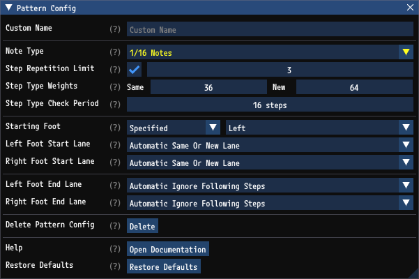

### Custom Name

`Custom Name` lets you set a name for the pattern. This is optional. If a custom name is present, it will be preferred over the [Abbreviation](AutogenConfigs.md#abbreviation-1) throughout the UI.

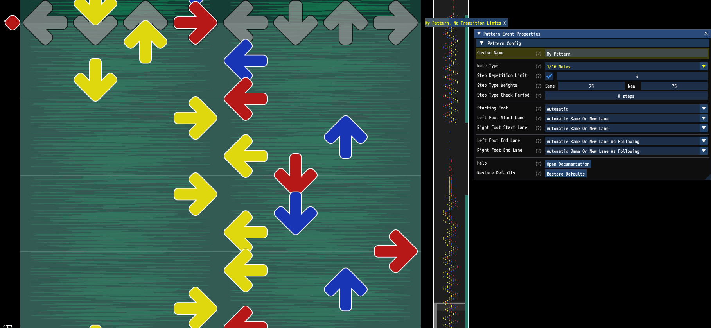

### Note Type

`Note Type` controls which type of notes are generated. Patterns always generate stream with a constant frequency.

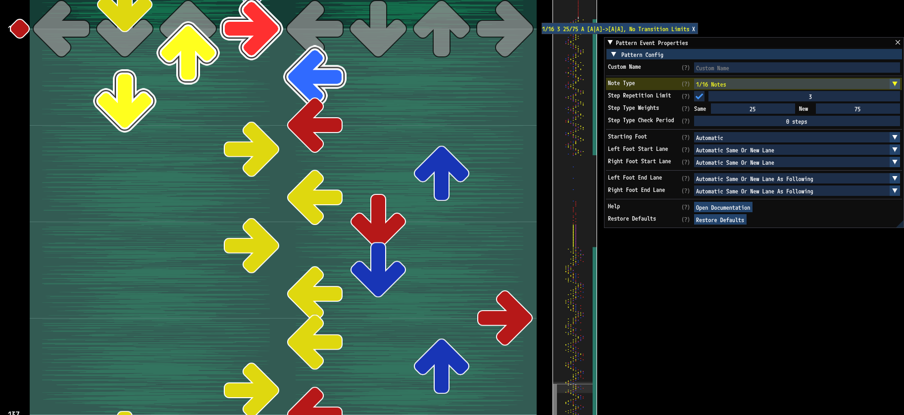

### Step Repetition Limit

`Step Repetition Limit` is used to cap the number of consecutive steps on the same arrow per foot.

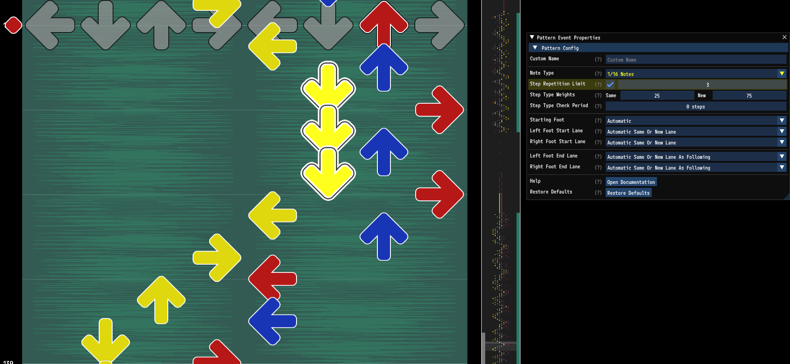

### Step Type Weights

`Step Type Weights` determine the ratio of same arrow to new arrow steps in the pattern. This pattern for example uses 90% new arrow steps and 10% same arrow steps.

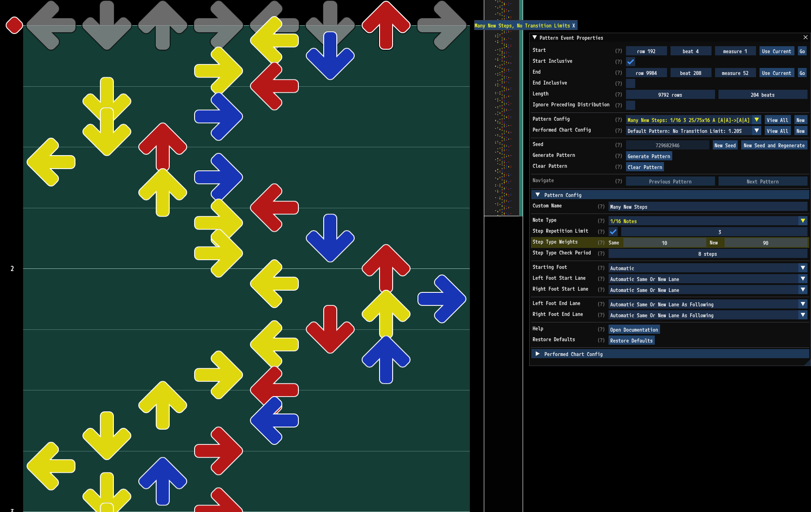

Here is the same pattern with 10% new arrow steps and 90% same arrow steps.

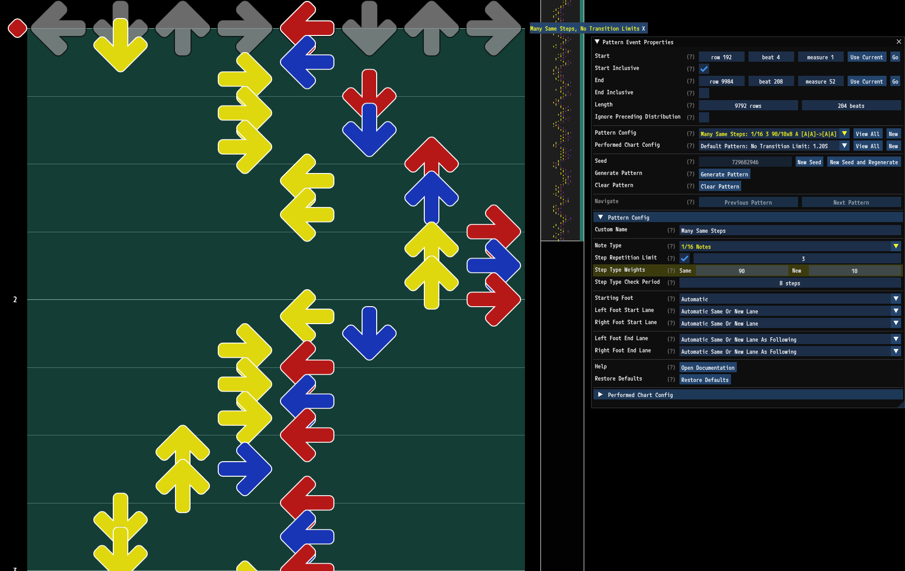

### Step Type Check Period

`Step Type Check Period` defines how frequently the desired `Step Type Weights` should be checked. Any value under `2` results in trying to match the weights continuously. Larger values will still maintain the desired distribution of steps, but it will allow more variance in the steps. Consider this example. This pattern specifies 1/3 of the steps should be on the same arrow and 2/3 should be on new arrows. When using `Step Type Check Period` of `0` it results in a very regular pattern of new new same, new new same, new new same...

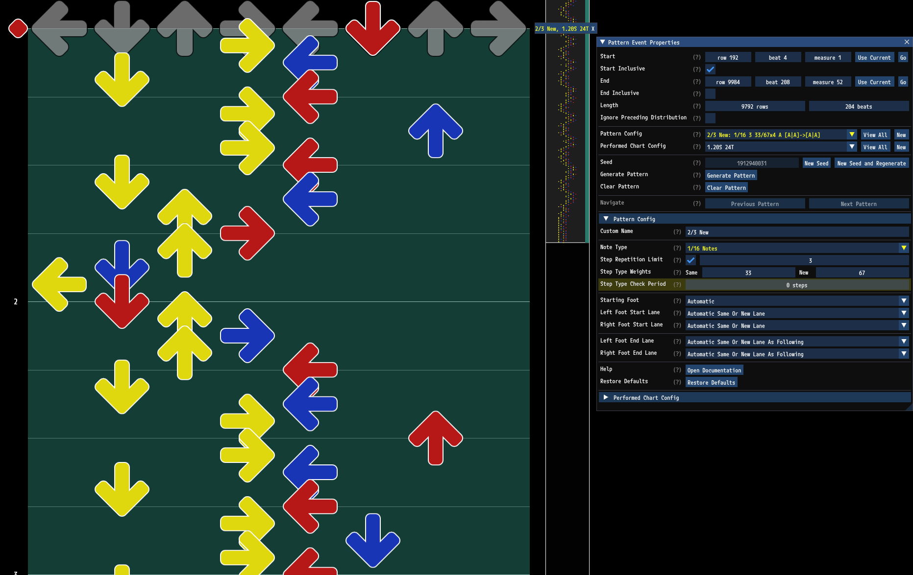

Increasing the `Step Type Check Period` to `4` allows the pattern to deviate more while still maintaining an overall distribution of same arrow and new arrow steps.

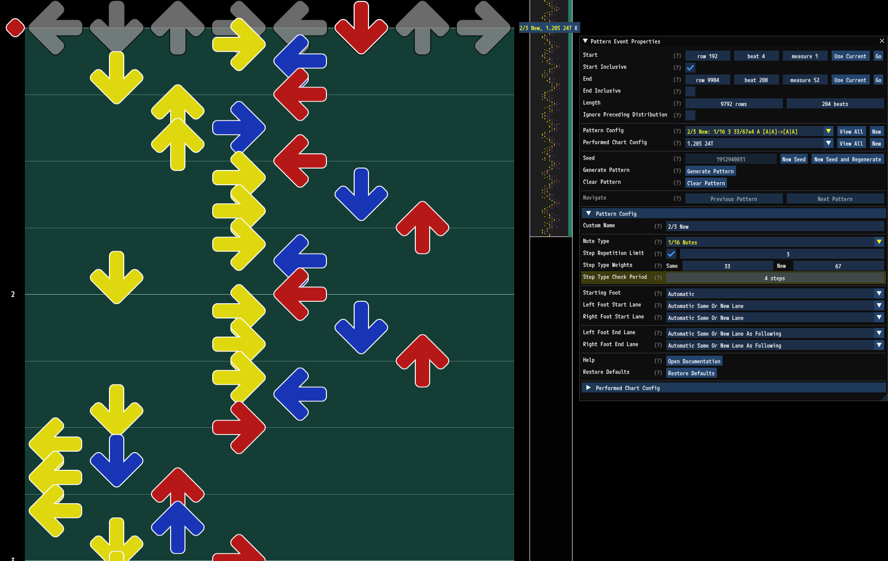

### Starting Footing

`Starting Foot` specifies which foot should start the pattern.
- `Automatic` will choose the best starting foot based on the surrounding steps.
- `Specified` will let you specify an explicit foot to start with.
- `Random` will choose a starting foot randomly.

`Left Foot Start Lane` and `Right Foot Start Lane` specify which lane each foot should start on.
- `Automatic Same Lane` will choose the same lane the foot was on prior to the pattern.
- `Automatic New Lane` will choose a new lane that can be safely stepped to from the lane the foot was on prior to the pattern.
- `Automatic Same Or New Lane` will choose either the same lane or a new lane that can be safely stepped to.
- `Specified Lane` lets you set an explicit lane to start on regardless of the surrounding steps.

By choosing `Automatic` for `Starting Foot` and `Automatic Same Or New Lane` for `Left Foot Start Lane` and `Right Foot Start Lane` you can easily make patterns which automatically connect naturally to the preceding steps.

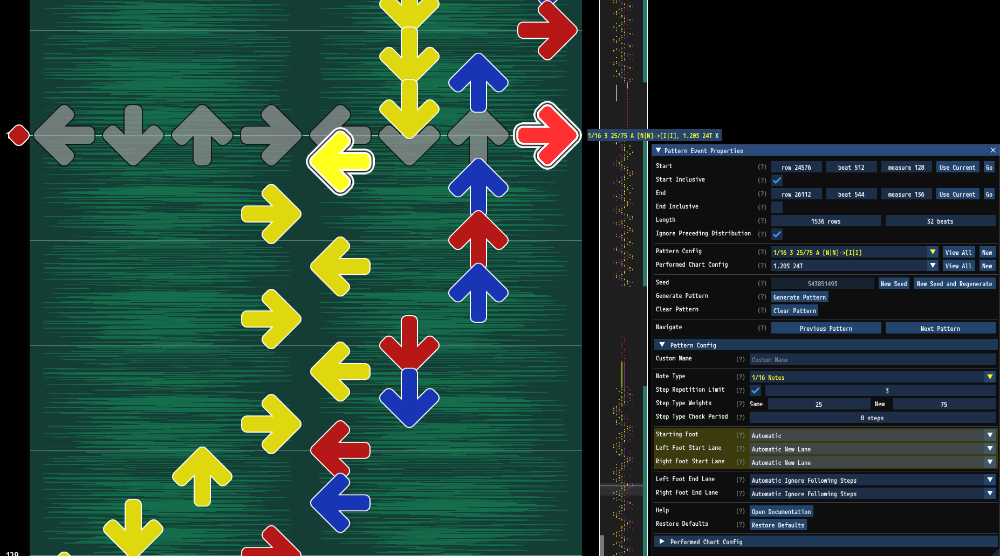

### Ending Footing

`Left Foot End Lane` and `Right Foot End Lane` specify which lane each foot should end on.
- `Automatic Ignore Following Steps` will not restrict the end footing.
- `Automatic Same Lane To Following` will examine any existing steps following the pattern and choose the same lane the foot will be on.
- `Automatic New Lane To Following` will examine any existing steps following the pattern and choose a new lane that can safely step to the lane the foot will be on.
- `Automatic Same Or New Lane To Following` will examine any existing steps following the pattern and choose either the same lane or a new lane that can safely step to the lane the foot will be on.
- `Specified Lane` lets you set an explicit lane to end on regardless of the surrounding steps.

By choosing `Automatic Same Or New Lane` for `Left Foot End Lane` and `Right Foot End Lane` you can easily make patterns which automatically connect naturally to the following steps.

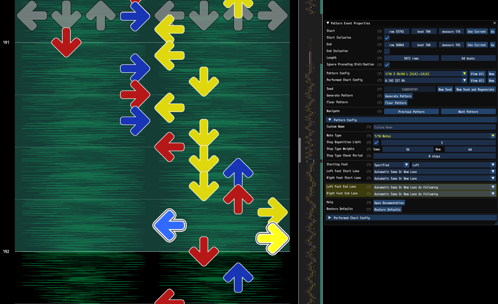

By choosing `Automatic Ignore Following Steps` for `Left Foot End Lane` and `Right Foot End Lane` you can easily make patterns which most closely abide to the other configuration rules. These patterns will still flow naturally if they are followed by another pattern which is configured to start naturally after its preceding steps. In the example below the pattern ends while ignoring any following steps. However the next pattern at measure 56 is adjacent to it and is configured with an `Automatic` `Starting Foot` and `Automatic Same Or New Lane` for `Left Foot Start Lane` and `Right Foot Start Lane`, so it still flows naturally.

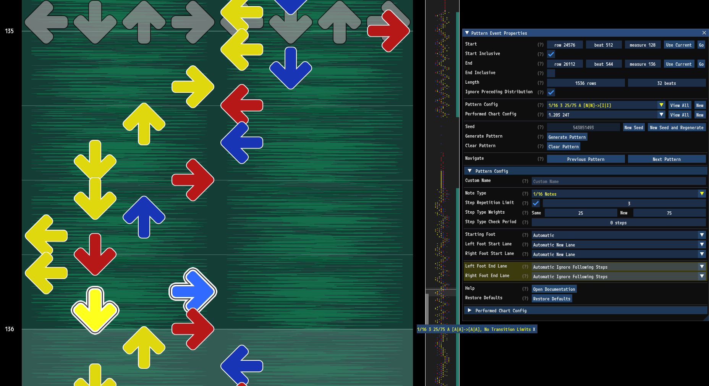