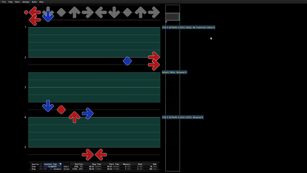

# Pattern Generation
Patterns are automatically generated sequences of steps in a chart.

## Prerequisites

Pattern generation requires the [StepGraph File](../../StepManiaLibrary/StepManiaLibrary/docs/StepGraphs.md#stepgraph-files) for the chart's [ChartType](../../StepManiaLibrary/StepManiaLibrary/docs/ChartType.md) to be loaded. GrooveAuthor loads StepGraph Files based on the `Startup Step Graphs` defined in the `Options`.

## Adding a New Pattern

Right click anywhere in the scene and select `Add Event` > `Pattern`.

This will add a new Pattern event at the current position and open the `Pattern Event Properties` window for the new Pattern. Patterns show up as teal regions in the chart with a widget adjacent to the start of the Pattern. Clicking the widget will also open the `Pattern Event Properties` Window.

## Adjusting Pattern Bounds

With the `Pattern Event Properties` window open you can manually set the start and end position in rows, beats, or measures. Adjusting the length can also be used to adjust the end position. Alternatively you can move the cursor to a desired position and then select `Use Current` to set either the start or end of the Pattern to your current position.

### Inclusivity

The `Start Inclusive` and `End Inclusive` checkboxes control whether steps can be created on the boundaries of the Pattern when generating the Pattern.

## Distribution

By default when steps are generated all the steps up to and including the Pattern's steps are considered for trying to match a good overall distribution among the lanes as defined by the [Performed Chart Config](PerformedChartConfigs.md)'s [Arrow Weights](PerformedChartConfigs.md#arrow-weights). `Ignore Preceding Distribution` lets a Pattern ignore the steps that precede it for this purpose.

## Random Seeds

Pattern generation involves some random choice and uses the Pattern's random seed. If no dependencies change, using the same random seed will result in the same generated steps for the Pattern each time it is generated. A new random seed can be chosen with the `New Seed` button. 

## Generating Patterns

Press the `Generate Pattern` in the `Pattern Event Properties` window to generate the Pattern.

You can also regenerate multiple Patterns simultaneously by selecting multiple patterns with mouse cursor and then selecting one of the `Regenerate Selected Patterns` options from the `Autogen` menu.

## Adjusting Patterns

When adjusting Patterns it is important to understand that some data is configured per Pattern instance and some is configured on [Autogen Configs](AutogenConfigs.md) which can be shared by many Patterns, including Patterns from other songs and charts which may not be open. It is helpful to think of Autogen Configs as rules you want to reuse, and individual Pattern events as instances of those rules with a small amount of per-instance data. Adjusting the steps for a Pattern is done primarily through the Autogen Configs the Pattern references.

### Pattern Instance Data

Pattern instance data is everything described above. It is everything in the `Pattern Event Properties` window that is not nested under `Pattern Config` or `Performed Chart Config`. This data only affects one Pattern event.

### Autogen Config Data

Patterns reference two types of [Autogen Configs](AutogenConfigs.md): [Pattern Configs](PatternConfigs.md) and [Performed Chart Configs](PerformedChartConfigs.md). These referenced Autogen Configs can be set from the `Pattern Config` and `Performed Chart Config` dropdowns respectively. They can each also be edited directly from within the `Pattern Event Properties` window by expanding the corresponding sections at the bottom of the window. Note that [Default Pattern Configs](AutogenConfigs.md#default-pattern-configs-1) and [Default Performed Chart Configs](AutogenConfigs.md#default-pattern-configs) cannot be edited, and editing any Autogen Config is editing a *reference* that is not limited to just one Pattern event.

### Applying Config Rules

When generating steps, many rules are at play and they can almost never all be satisfied perfectly. See [Performed Chart Determination](../../StepManiaLibrary/StepManiaLibrary/docs/PerformedChart.md#performedchart-determination) and [Pattern Determination](../../StepManiaLibrary/StepManiaLibrary/docs/PerformedChart.md#pattern-determination) for specifics on how these rules are combined in order to generate the best pattern.

## Saving

The steps generated by a Pattern are saved as normal steps in the song's `ssc` or `sm` file. The pattern instances are saved directly into the song `ssc` or `sm` file using custom `msd` data that StepMania will ignore.

### SSC Files

For `ssc` files, pattern data is saved per-chart under `#GAChartData` properties. `#GAChartData` includes both pattern data, and any other custom data GrooveAuthor persists per-chart.

### SM Files

For `sm` files, pattern data is saved at the song level under `#GAChartDataCHART<chart-index>` properties where `<chart-index>` is the index of the chart in question. These properties include both pattern data, and any other custom data GrooveAuthor persists per-chart.

### Autogen Configs

Only Pattern instance data is saved per chart. The Autogen Configs that Patterns reference are automatically persisted separately. See [Autogen Config Persistence](AutogenConfigs.md#autogen-config-persistence).

### Sharing Files With Patterns

Songs containing charts with Patterns can be played in StepMania and can be used by any application with support for normal `ssc` or `sm` files. When using `GrooveAuthor` to open a chart with Patterns made by another user, the Patterns will be maintained. If you want other `GrooveAuthor` users to be able to see and use custom Autogen Configs referenced by your Patterns, that data should be shared along with the song. Custom Config data is saved to the `AutogenConfigs` folder. See [Autogen Config Persistence](AutogenConfigs.md#autogen-config-persistence) for more details.

If you do not have the Autogen Configs referenced by a song, warnings will be logged and the Patterns will be adjusted to reference default Autogen Configs. The steps from the Patterns will not be affected unless you regenerate the Patterns. The song file will not be affected unless you save.

