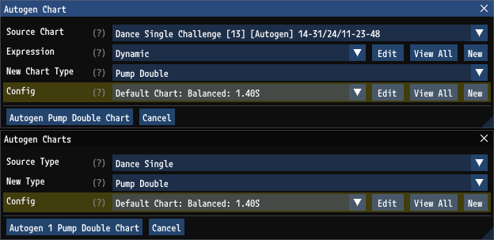

# Performed Chart Configs

Performed Chart Configs are a kind of [Autogen Config](AutogenConfigs.md) that define settings for how generated steps are positioned. These rules are used for both [Pattern Generation](PatternConfigs.md) and [Chart Generation](ChartGeneration.md). This document describes Performed Chart Config settings and how those settings affect generated steps. For information on how to browse, add, and delete Performed Chart Configs, see the [Performed Chart Configs](AutogenConfigs.md#performed-chart-configs) section of the [Autogen Configs](AutogenConfigs.md) document.

## StepManiaLibrary

`GrooveAuthor` uses [StepManiaLibrary](https://github.com/PerryAsleep/StepManiaLibrary) for autogen functionality. The `StepManiaLibrary` [Performed Chart](../../StepManiaLibrary/StepManiaLibrary/docs/PerformedChart.md) documentation accurately describes the `GrooveAuthor` functionality, though it is written assuming rules are defined in `json` rather than through the GUI that `GrooveAuthor` provides.

## Applying Config Rules

When positioning steps, many rules are at play and they can almost never all be satisfied perfectly. See [Performed Chart Determination](../../StepManiaLibrary/StepManiaLibrary/docs/PerformedChart.md#performedchart-determination) for specifics on how these rules are combined in order to position steps.

## Usage with Autogen

Performed Chart Configs are configured in the `Autogen Chart` and `Autogen Charts` windows when performing [Chart Generation](ChartGeneration.md).

Performed Chart Configs are configured on pattern events for performing [Pattern Generation](PatternGeneration.md).

## Performed Chart Config Window

Performed Chart Configs are edited through the `Performed Chart Config` window. This is accessible by clicking on a Performed Chart Config from the [Autogen Configs](AutogenConfigs.md) window.

### Name and Description

`Name` and `Description` are fields which identify and describe Performed Chart Configs so they can be selected easily throughout `GrooveAuthor`. Performed Chart Configs also have an [Abbreviation](AutogenConfigs.md#abbreviation)

### Step Tightening

Step Tightening rules limit individual step movements. Step Tightening involves measuring movement. These measurement units are in panel widths and assume square panels. 

#### Movement Compensation

Step Tightening rules involve measuring movements. `Movement Compensation` values are used to compensate for the fact that when players perform movements to satisfy a chart they don't move to the center of the panels. For example in singles, players only use their toes for the up arrows and they only use their heels for the down arrows. A detailed explanation of these values can be found in the `StepManiaLibrary` [Step Tightening Controls](../../StepManiaLibrary/StepManiaLibrary/docs/StepTighteningControls.md) document under [Minimum Panel Distances](../../StepManiaLibrary/StepManiaLibrary/docs/StepTighteningControls.md#minimum-panel-distances). `GrooveAuthor` uses sensible default values:
 - `Lat` (Lateral) Compensation: 1/6. This means a foot moving sideways only needs to move 1/6 into a panel to trigger it.
 - `Long` (Longitudinal) Compensation: -1/8. This means a foot moving front to back or back to front can be centered 1/8 outside of a panel to trigger it.

When considering distances involving brackets, compensation is not used. The position of the foot is assumed to be directly between the two panels being bracketed.

It is not recommended to change these values.

#### Stretch Tightening

`Stretch` limits stretch movements. This is not useful for [Pattern Generation](PatternConfigs.md) as patterns never generate stretch. This is primarily useful for [Chart Generation](ChartGeneration.md) when the source chart has stretch and you want to restrict wide stretch in the generated chart. Stretch movements are measured as the distance between both feet, rather than the distance moved in a single step. In the example below stretch movements beginning at 2 1/3 are penalized with increasing severity up to 3 1/3, though any distance beyond 2 1/3 is penalized. These distances take into account [Movement Compensation](PerformedChartConfigs.md#movement-compensation).

See `StepManiaLibrary` [Stretch Tightening](../../StepManiaLibrary/StepManiaLibrary/docs/StepTighteningControls.md#stretch-tightening) documentation for more details and examples.

#### Distance Tightening

`Distance` limits individual step distances regardless of their speed. This is useful in both [Pattern Generation](PatternConfigs.md) and [Chart Generation](ChartGeneration.md). In the example below movements beginning at 1.4 are penalized with increasing severity up to 2 1/3, though any distance beyond 1.4 is penalized. These distances take into account [Movement Compensation](PerformedChartConfigs.md#movement-compensation). These values combined with the movement compensation values above have the following effects:
- A move 2 panels laterally and 1 longitudinally is not penalized.
- A move 2 panels laterally and 2 longitudinally is penalized.
- A move 3 panels laterally is penalized.
- A bracket move of 2 or more is penalized.

These example values are reasonable defaults for limiting `dance-double` movements.

See `StepManiaLibrary` [Distance Tightening](../../StepManiaLibrary/StepManiaLibrary/docs/StepTighteningControls.md#distance-tightening) documentation for more details and examples.

#### Speed Tightening

`Speed` and `Speed Min Distance` limit individual step distances if those steps are over a specified speed. This is less useful for [Pattern Generation](PatternConfigs.md) where the speed is typically constant and more useful for [Chart Generation](ChartGeneration.md) where the speed of steps will vary throughout the chart and you may want fast steps to move less than slow steps. In the example below steps moving at a speed equal to 1/16th notes at 125BPM are penalized with increasing severity up to 175BPM, though any speed beyond 1/16ths at 125BPM are penalized.

While these rules measure speed, they penalize larger distances. `Speed Min Distance` can be used to allow all steps under a certain distance to be treated as equally valid when subject to speed tightening. Perhaps for example in a fast section that you want to have limited movement, you still want to allow candles. Candles move more than other steps like moving between two bracketable arrows. Therefore candles would be penalized more, resulting in their absence. Setting a `Speed Min Distance` to a value which allows candles (e.g. 0.76 with the example [Movement Compensation](PerformedChartConfigs.md#movement-compensation) values above) will allow them to occur.

See `StepManiaLibrary` [Speed Tightening](../../StepManiaLibrary/StepManiaLibrary/docs/StepTighteningControls.md#speed-tightening) documentation for more details and examples.

### Lateral Tightening

Lateral Tightening rules limit steps which move sideways quickly. This is mostly useful for wide [ChartTypes](../../StepManiaLibrary/StepManiaLibrary/docs/ChartType.md) like `dance-double` to prevent transitions on burst. This is less useful for [Pattern Generation](PatternConfigs.md) where the speed is typically constant and more useful for [Chart Generation](ChartGeneration.md) where the speed of steps will vary throughout the chart and you may want to limit movement on the faster sections. In the example below, lateral (side-to-side) body movements of at least 3 panels/s will be penalized if the steps involved in that movement are at least 1.65x as dense as the chart average, or if the steps are at least 12 notes/s.

See `StepManiaLibrary` [Lateral Tightening](../../StepManiaLibrary/StepManiaLibrary/docs/LateralTighteningControls.md) documentation for more details and examples.

### Facing Controls

Facing Controls limit inward or outward facing orientations. This is useful in both [Pattern Generation](PatternConfigs.md) and [Chart Generation](ChartGeneration.md) but is aimed more for Pattern Generation. Orientations are defined by a cutoff percentage of the overall pads width, which is used to determine if the player is fully on the left or right side of the pads. If they are on the left or right side, then orientations where the feet are in different longitudinal positions are considered inward or outward facing. In the example below there are no limits enforced because both inward and outward max percentages are set to 100%. To penalize all inward facing steps `Max Inward Percent` could be set to 0.0.

See `StepManiaLibrary` [Facing Controls](../../StepManiaLibrary/StepManiaLibrary/docs/FacingControls.md) documentation for more details and examples.

### Transition Controls

Transition Controls are primarily used for limiting pad transitions in wide [ChartTypes](../../StepManiaLibrary/StepManiaLibrary/docs/ChartType.md) like `dance-double`. This is useful in both [Pattern Generation](PatternConfigs.md) and [Chart Generation](ChartGeneration.md). In the example below on any [ChartType](../../StepManiaLibrary/StepManiaLibrary/docs/ChartType.md) at least 5 panels wide steps that transition both feet over 50% of the pads width more frequently than once every 16 steps will be penalized. It will also penalize steps which don't transition at least once every 1024 step, but in practice this will be ignored as without limiting transitions steps tend to transition frequently due to trying to match good [Arrow Weights](#arrow-weights). Note that pad width is measured not by number of lanes, but the physical width of the pads. So while `dance-double` is 8 lanes, it is 6 panels.

See `StepManiaLibrary` [Transition Controls](../../StepManiaLibrary/StepManiaLibrary/docs/TransitionControls.md) documentation for more details and examples.

### Arrow Weights

The lowest priority rule when distributing steps is to penalize paths by how much they deviate from a good overall distribution of steps among the lanes. The distribution that is attempted to be matched is defined in `Arrow Weights`. Each Performed Chart Config can specify a weight distribution per [ChartType](../../StepManiaLibrary/StepManiaLibrary/docs/ChartType.md)

When generating patterns, steps outside the pattern range can be excluded from consideration for weight distribution by using the [Ignore Preceding Distribution](PatternGeneration.md#distribution) setting.

See also `StepManiaLibrary` [Arrow Weights](../../StepManiaLibrary/StepManiaLibrary/docs/PerformedChart.md#arrowweights) documentation.

