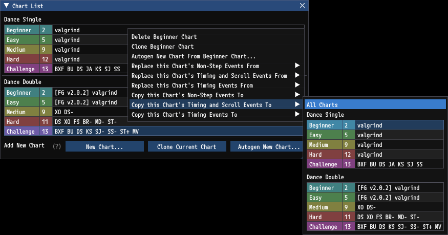
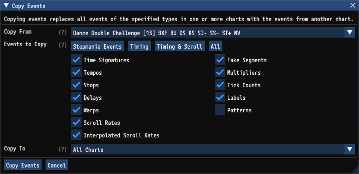
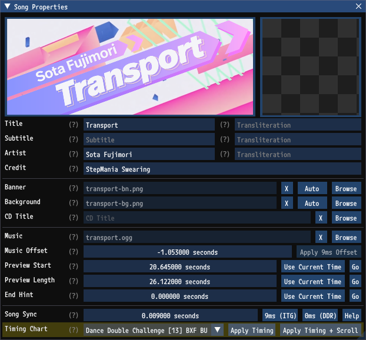

# Song and Chart Timing

## Song Timing vs. Chart Timing

In StepMania and in `GrooveAuthor`, there are songs and charts. Songs have one or more charts. Some data is defined on the song, like the title, artist, and banner. Other data is defined per chart, like the difficulty and steps. Historically, events which affect timing were defined on the song and not the chart. The older `sm` format requires this. This means different charts for the same song cannot independently specify distinct rate gimmicks (e.g. "ACE FOR ACES" in DDR and many songs in PIU) and it means songs where each chart should use different music are unsupported (e.g. "Scripted Connection" or "Crew" from beatmania IIDX). Both of these restrictions are not good. It would be better if timing events were defined per chart rather than per song.

In StepMania 5 the `ssc` format was introduced which addresses this problem and allows for specifying timing data on the charts instead of the songs. However, StepMania's editor still prefers song timing. Timing events can be per-song or per-chart and it is often unclear when you are editing these events which charts are affected.

## GrooveAuthor Uses Chart Timing

`GrooveAuthor` always uses chart timing and never uses song timing. All events, including timing events, are per-chart. To be explicit, these events are always only on the chart and never on the song:
- Time Signature (`#TIMESIGNATURES`)
- Tempo (`#BPMS`)
- Stop (`#STOPS`)
- Delay (`#DELAYS`)
- Warp (`#WARPS`)
- Scroll Rate (`#SCROLLS`)
- Interpolated Scroll Rate (`#SPEEDS`)
- Fake Region (`#FAKES`)
- Combo Multipliers (`#COMBOS`)
- Ticks Count (`#TICKCOUNTS`)
- Label (`#LABELS`)
- Attacks (`#ATTACKS`)

By keeping events always on the charts rather than the song, there is no confusion about what is affected by edits.

## Keeping Chart Timing In Sync

Often, the timing events should be the same between all charts in a song. To make this easy `GrooveAuthor` offers the following tools.

Right clicking any chart in the `Chart List` window brings up options for synchronizing timing events between two charts, or between all charts.

The groups in this context menu encompass the following events.

| Event                    | Non-Step Event | Scroll Event | Timing Event |
|--------------------------|----------------|--------------|--------------|
| Time Signature           | X              |              | X            |
| Tempo                    | X              |              | X            |
| Stop                     | X              |              | X            |
| Delay                    | X              |              | X            |
| Warp                     | X              |              | X            |
| Scroll Rate              | X              | X            |              |
| Interpolated Scroll Rate | X              | X            |              |
| Fake Region              | X              |              |              |
| Multipliers              | X              |              |              |
| Tick Counts              | X              |              |              |
| Label                    | X              |              |              |
| Attack                   | X              |              |              |
| Pattern                  |                |              |              |

Additionally, the `Copy Events` window accessible from the menu bar via `Chart` > `Advanced Event Copy...` will let you specify exactly which events you would like to copy.

## Timing Chart

Unfortunately there is a bug in StepMania where if certain timing data is not specified on the song then some animations will play at the wrong speed. Even on a valid song with all charts specifying full, valid timing data, StepMania only examines song timing data for animations on the song wheel like cursor pulsing, and some animations during play like receptor pulsing. In the absence of valid song data StepMania falls back to using a tempo of 60 BPM for these animations.

To work around this issue `GrooveAuthor` always assigns one chart as the song's `Timing Chart`. The timing data from the `Timing Chart` is applied to the song when saving so that StepMania will not play animations incorrectly. When `GrooveAuthor` chooses a `Timing Chart` it prefers your `Default Type` and `Default Difficulty` specified in the `Options` window. However, the `Timing Chart` can always be assigned explicitly in the `Song Properties` window. 

The `Apply...` button next to the `Timing Chart` presents a number of options for quickly applying timing, scroll, and other events from the `Timing Chart` to all other charts.

## Saving Simfiles

See [Saving Simfiles](SavingSimfiles.md) for details on simfile formats and how `GrooveAuthor` handles saving timing data.