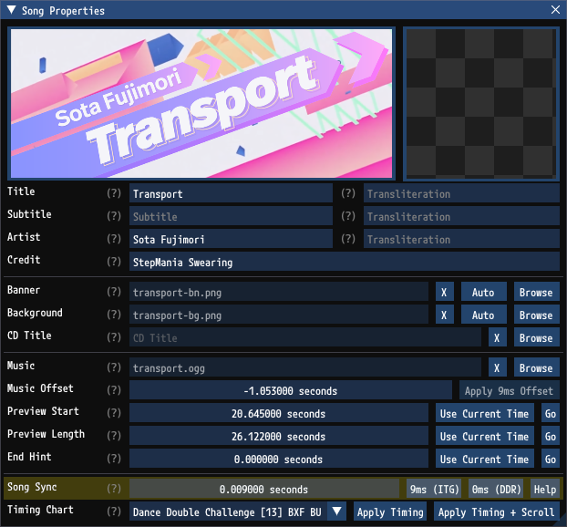
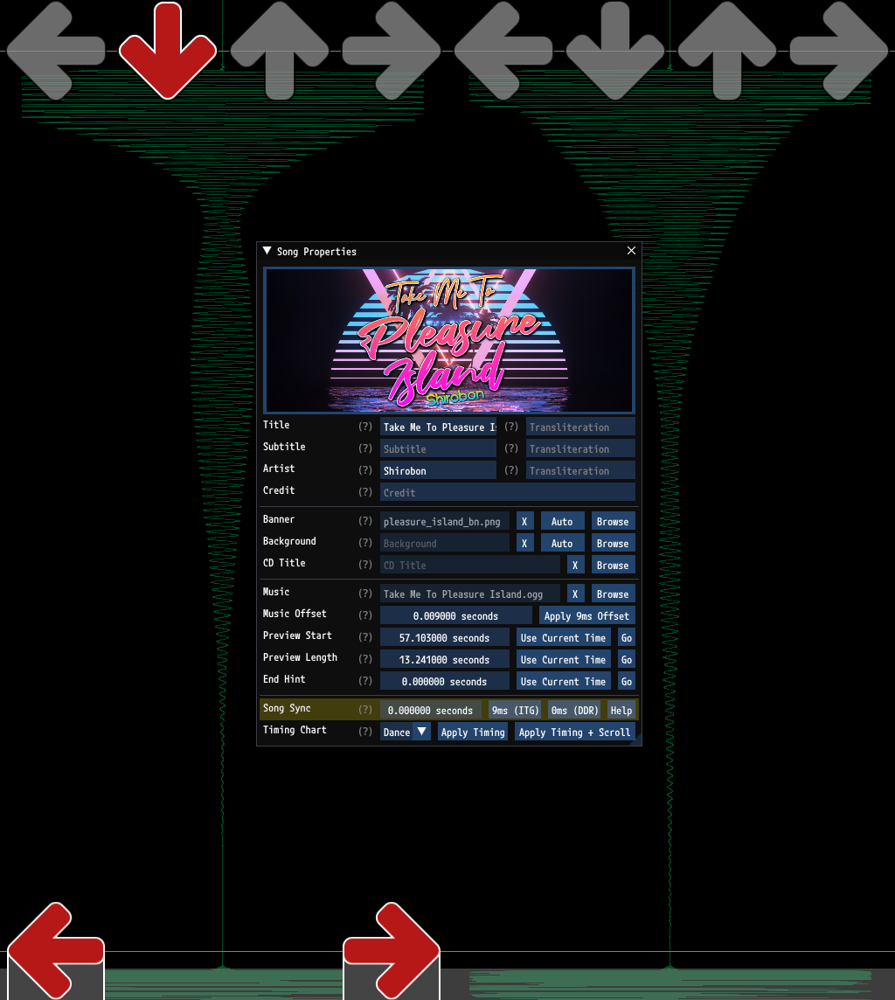
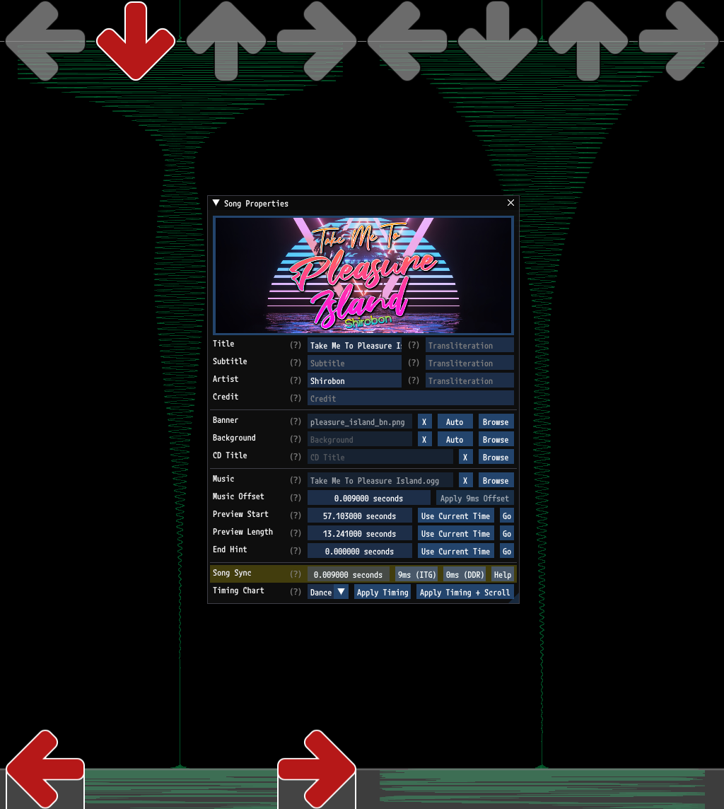
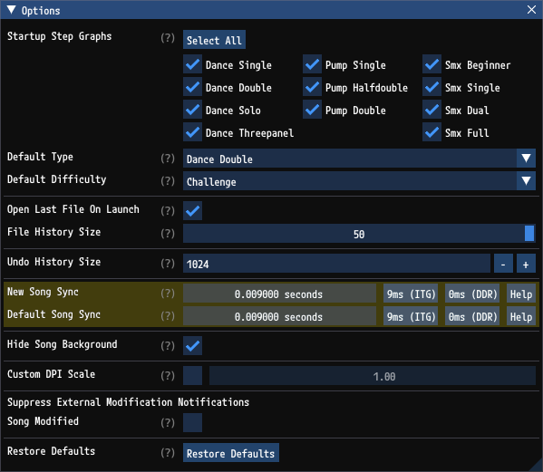

# Song Sync

When creating charts it is important that the steps feel like they are in sync with the music. Intuitively that means that steps should occur at the same time as sounds in the music. In practice however what players expect is for charts to be synced consistently, regardless of whether the sync is "correct" or not. If you have a lot of content on your setup and you download a new song, you expect that new song to be synced in the same manner as the rest of your content.

## 9ms vs. 0ms

In practice most but not all content is synced such that steps are 9ms earlier than the music. For a detailed explanation on the history and why this is still the standard please see [The 9ms Bias](https://itgwiki.dominick.cc/en/packs-and-simfiles/the-9ms-bias) article on [ITG Wiki](https://itgwiki.dominick.cc/). Very broadly speaking, content made for home StepMania setups is generally synced for 9ms whereas content made for DDR is synced for 0ms. The existence of two standards is problematic. `GrooveAuthor` offers a few tools for handling this.

## Song Sync

`GrooveAuthor` exposes a `Song Sync` value on a song. This is an editor-only value that is used to tell `GrooveAuthor` what the sync is. The `Song Sync` value can be set in the `Song Properties` window. This value is completely independent of the `Music Offset`. Changes to the `Song Sync` will in no way affect the song's perceived sync in StepMania.

### Sound Effects

The `Song Sync` value is used when `GrooveAuthor` plays assist tick or beat tick sounds. This ensures that even if your song is synced to 9ms, the tick sounds for steps will be internally adjusted so that they still line up perfectly with the music.

### Waveform

The `Song Sync` value is used when `GrooveAuthor` renders the song waveform. This ensures that when you are visually comparing steps to the music they are always perfectly aligned. Consider the example below. This song is synced to 9ms. This is good. To most players this will feel correct, but because of the offset the audio doesn't line up so trying to sync things visually is challenging and misleading. Notice how the steps occur before the music.

By specifying a `Song Sync` that matches the actual sync of 9ms, the waveform lines up accurately with the steps. Nothing has changed about the sync as far as StepMania is concerned. The `Music Offset` is still the same. This song will still feel correct, but now the waveform accurately aligns with the steps.

## Default Song Sync

It is common to author content with a consistent sync. `GrooveAuthor` has two options to assist with this. These can be found in the `Options` window.

- `New Song Sync` specifies what `Song Sync` value you'd like to apply when creating new songs through `GrooveAuthor`.
- `Default Song Sync` specifies what `Song Sync` value you'd like to apply when opening existing songs that have an unknown sync.

